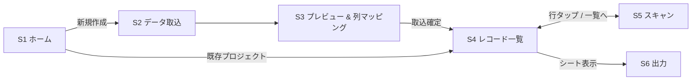

# 機能・画面設計書

PRD（docs/PRD.md）に基づく MVP の機能設計・画面設計。

- 対象OS: iOS 17+（SwiftData が必須要件のため）
- 技術: SwiftUI / SwiftData / VisionKit（AVFoundation フォールバック）

---

# 1. 全体構成

## 1.1 作業単位「プロジェクト」

取込 1 回分の表データを **プロジェクト** として管理する。

- PRD の「途中終了しても続きから再開できること」を自然に満たす
- 過去の作業を消さずに新しい取込を始められる
- SwiftData で複数管理してもコストがほぼ増えないため、MVP から複数プロジェクト対応とする

## 1.2 画面一覧と遷移

| # | 画面 | 役割 |
|---|------|------|
| S1 | ホーム（プロジェクト一覧） | 作業の再開・新規作成・削除 |
| S2 | データ取込 | ペースト / CSV ファイル読込 |
| S3 | プレビュー & 列マッピング | 取込内容の確認と列の割当 |
| S4 | レコード一覧 | 全行と状態の確認、任意の行へ移動 |
| S5 | スキャン | カメラで連続スキャン（アプリの中核） |
| S6 | 出力 | CSV 保存 / クリップボード / Share Sheet |



- S4（一覧）をプロジェクトのハブ画面とし、スキャン・出力へはここから遷移する
- S5（スキャン）はフルスクリーン表示。閉じると S4 に戻る

---

# 2. データモデル（SwiftData）

```swift
@Model
final class Project {
    var id: UUID
    var name: String              // 既定値: 取込日時（例 "2026-07-27 14:30"）
    var createdAt: Date
    var updatedAt: Date

    var columnNames: [String]     // ヘッダー名。ヘッダーなしの場合 "列1", "列2", …
    var identifierColumnIndex: Int  // 識別列
    var displayColumnIndex: Int     // 表示列
    var barcodeColumnIndex: Int     // 書込列

    var currentPosition: Int      // 次にスキャンする行（再開位置）

    @Relationship(deleteRule: .cascade)
    var rows: [Row]
}

@Model
final class Row {
    var sortIndex: Int            // 元データの行順
    var values: [String]          // 取り込んだ元の行データ
    var barcode: String?          // 割り当てたコード
    var status: RowStatus         // 未登録 / 登録済み / スキップ
    var scannedAt: Date?
}

enum RowStatus: Int, Codable {
    case pending    // 未登録
    case registered // 登録済み
    case skipped    // スキップ
}
```

## 設計上の決め事

- **書込列に既存値がある行**: 取込時に `barcode` へ読み込み、状態を「登録済み」とする（再スキャンで上書き可能）
- **元データは不変**: `values` は取込時のまま保持し、コードは `barcode` に持つ。出力時に書込列へ合成する。これにより「やり直し」「元データ確認」が常に可能
- **再開位置**: `currentPosition` はスキャンのたびに保存する（自動保存要件）

---

# 3. 機能設計

## 3.1 データ取込

### ペースト取込
- テキストエリアへの貼り付け、または「クリップボードから貼り付け」ボタン
- **区切り文字の自動判定**: タブ → カンマ → セミコロンの優先順で検出（スプレッドシート/Excel のコピーはタブ区切り）
- 判定結果は S3 で手動変更可能

### CSV ファイル読込
- `fileImporter`（Files アプリ経由）で `.csv` / `.txt` / `.tsv` を選択
- 文字コードは UTF-8（BOM 付き含む）→ Shift_JIS の順で試行

### パーサ仕様（Swift 標準実装）
- RFC 4180 準拠: ダブルクォート囲み、囲み内の改行・カンマ・エスケープ（`""`）に対応
- 空行はスキップ。列数が不揃いの行は空文字で埋める
- ヘッダー行の有無はユーザーが S3 で指定（初期値: あり）

## 3.2 列マッピング

- 識別列・表示列・書込列を Picker で選択
- **初期値の自動推定**: ヘッダー名にマッチする列を候補にする
  - 書込列: 「JAN」「バーコード」「コード」「barcode」「UPC」等
  - 識別列: 「番号」「ID」「品番」「SKU」等
  - 推定できない場合は 1列目=識別、2列目=表示、最終列=書込
- **書込列が既存表にない場合**: 「新しい列を追加」を選択できる（列名を入力、既定値 "バーコード"）

## 3.3 スキャン

### 対応シンボロジー
JAN-13（EAN-13）/ JAN-8（EAN-8）/ UPC-A / UPC-E / Code128 / Code39 / QR コード

### スキャナ実装（疎結合）
```swift
protocol BarcodeScannerService {
    var isAvailable: Bool { get }
    func start(onDetect: @escaping (String) -> Void)
    func stop()
}
```
- 第一候補: VisionKit `DataScannerViewController`（`isSupported` / `isAvailable` を確認）
- フォールバック: AVFoundation `AVCaptureMetadataOutput`
- UI 層はプロトコルのみに依存し、将来の Bluetooth リーダー対応も同じ口で追加できるようにする

### 読み取り成功時のフロー
1. 重複チェック（3.4）
2. `barcode` 保存・状態を「登録済み」へ・`scannedAt` 記録
3. 成功音（`AudioServicesPlaySystemSound`）+ 振動（`UINotificationFeedbackGenerator.success`）
4. `currentPosition` を次の「未登録」行へ進めて自動保存
5. 次の商品情報を表示（スキャン継続）

### 連続読み取りの誤動作対策
- 保存直後 約1秒間は同一コードの再検出を無視（クールダウン）
- 全行完了時は完了表示を出し、出力（S6）へ誘導

## 3.4 重複チェック

- スキャンしたコードがプロジェクト内の他の行に登録済みの場合、警告を表示する
- 表示内容: 「このバーコードは既に登録されています。」+ 登録済み行の識別列・表示列の値
- 選択肢: **「このまま登録」**（重複を許容して保存）/ **「キャンセル」**（保存せず継続）
- チェック範囲は同一プロジェクト内のみ

## 3.5 出力

| 方式 | 形式 | 用途 |
|------|------|------|
| クリップボードコピー | **タブ区切り（TSV）** | Google スプレッドシート / Excel へそのまま貼り付け |
| CSV 保存 | RFC 4180 準拠 CSV（UTF-8 BOM 付き） | ファイルとして保存（Excel 互換のため BOM 付き） |
| Share Sheet | CSV ファイル | AirDrop・メール等 |

- 出力内容: 元の列構成のまま、書込列へ `barcode` を合成した全行
- オプション: ヘッダー行を含める（初期値 ON）/ 書込列のみコピー（1列だけ貼り付けたいケース）

## 3.6 進捗管理・再開

- 保存項目: `currentPosition` / 登録済・スキップ・未登録件数（rows から算出）
- すべての操作直後に SwiftData へ保存（明示的な保存ボタンは置かない）
- アプリ再起動後、ホームの各プロジェクトに進捗（例: `120 / 300 件`）を表示し、タップで続きから再開

---

# 4. 画面設計

## S1 ホーム（プロジェクト一覧）

```
┌──────────────────────────────┐
│ バーコード割当                │
├──────────────────────────────┤
│ ┌──────────────────────────┐ │
│ │ 2026-07-27 夏物商品       │ │
│ │ ████████░░ 120/300 登録済 │ │
│ └──────────────────────────┘ │
│ ┌──────────────────────────┐ │
│ │ 2026-07-20 雑貨           │ │
│ │ ██████████ 完了 50/50     │ │
│ └──────────────────────────┘ │
│                              │
│        [＋ 新しい取込]        │
└──────────────────────────────┘
```

- 各カード: プロジェクト名 / 進捗バー / 登録済み・総件数 / 更新日
- タップ → S4、スワイプ削除（確認ダイアログあり）、長押しで名前変更
- 空状態: 「CSV やコピーした表を取り込んで始めましょう」+ 新規取込ボタン

## S2 データ取込

- セグメント切替: **貼り付け** / **CSV ファイル**
- 貼り付け: テキストエリア + 「クリップボードから貼り付け」ボタン。貼り付け直後に行数・列数を即時表示（例: 「300行 × 4列を検出」）
- CSV: 「ファイルを選択」→ `fileImporter`
- 「次へ」→ S3

## S3 プレビュー & 列マッピング

```
┌──────────────────────────────┐
│ ◀ 戻る   列の設定      次へ ▶ │
├──────────────────────────────┤
│ ☑ 1行目はヘッダー             │
│ 区切り: [タブ ▼]              │
├──────────────────────────────┤
│ 識別列   [商品番号 ▼]         │
│ 表示列   [商品名   ▼]         │
│ 書込列   [JAN     ▼]         │  ← 「＋新しい列を追加」も選択肢
├──────────────────────────────┤
│ プレビュー（先頭5行）          │
│ ┌────┬────────┬──────┐      │
│ │A001│Tシャツ白 │      │      │
│ │A002│Tシャツ黒 │      │      │
│ └────┴────────┴──────┘      │
├──────────────────────────────┤
│ 300行 / 既存コード 12件       │
└──────────────────────────────┘
```

- プレビュー表で識別列・表示列・書込列を色分けハイライト
- 「取込」実行でプロジェクト作成 → S4 へ
- バリデーション: 識別列と書込列が同一の場合は警告

## S4 レコード一覧

```
┌──────────────────────────────┐
│ ◀ ホーム  夏物商品    [出力]  │
├──────────────────────────────┤
│ ████████░░  登録120 ｽｷｯﾌﾟ5 残175│
│ [すべて|未登録|登録済み|スキップ] │
│ 🔍 検索                       │
├──────────────────────────────┤
│ ● A001  Tシャツ白             │
│         4901234567890         │
│ ○ A002  Tシャツ黒     （未）  │
│ ─ A003  Tシャツ灰  （スキップ）│
│   …                          │
├──────────────────────────────┤
│        [📷 スキャン開始]       │
└──────────────────────────────┘
```

- セグメントで状態フィルタ、検索は識別列・表示列・コードを対象
- 行タップ → その行を開始位置にして S5 へ
- 行スワイプ: 「スキップにする / 戻す」「コードを消去」
- 行の状態アイコン: ● 登録済み / ○ 未登録 / ─ スキップ
- 「スキャン開始」→ 現在位置（最初の未登録行）から S5 へ
- 「出力」→ S6 をシート表示

## S5 スキャン（中核画面・フルスクリーン）

```
┌──────────────────────────────┐
│ ✕ 閉じる      120/300  ████░░ │
├──────────────────────────────┤
│                              │
│      カメラプレビュー          │
│      （読取ガイド枠）          │
│                              │
├──────────────────────────────┤
│ A002  Tシャツ黒               │ ← 識別列 + 表示列（大きく表示）
│ コード: 未登録                 │
├──────────────────────────────┤
│ [◀ 前へ] [スキップ] [一覧] [⌨] │
└──────────────────────────────┘
```

- 上部: 進捗（登録済み/総数 + バー）、閉じるボタン
- 中央: カメラプレビュー
- 下部カード: 現在行の識別列・表示列の値、現在のコード（登録済みなら値を表示し、再スキャンで上書き確認）
- 操作: 前へ / スキップ（状態=スキップにして次へ）/ 一覧（S4 に戻る）/ ⌨ 手動入力
- 読取成功: 音 + 振動 + カード部を一瞬緑にフラッシュ → 自動で次の未登録行へ
- 重複時: 警告ダイアログ（3.4）。誤読防止のためダイアログ表示中はスキャン停止
- 全行完了: 「すべて完了しました 🎉」+ [出力へ] [一覧へ]
- カメラ権限拒否時: 設定アプリへの誘導を表示

> **⌨ 手動入力について**: PRD に記載はないが、カメラで読めないバーコード（かすれ・小さすぎる等）の救済手段として実務上ほぼ必須のため MVP に含める（実装コスト小）。

## S6 出力（シート）

- プレビュー: 出力される表の先頭数行
- オプション: ☑ ヘッダー行を含める / ☐ 書込列のみ
- ボタン（縦並び）:
  1. **クリップボードにコピー**（TSV）— 「スプレッドシートにそのまま貼り付けできます」の説明付き
  2. **CSV ファイルとして保存**（fileExporter）
  3. **共有**（Share Sheet）
- 未登録・スキップが残っている場合: 「未登録が175件あります」の注意表示（出力自体は可能）

---

# 5. 非機能要件への対応

| 要件 | 対応方針 |
|------|----------|
| オフライン | ネットワーク機能なし。全機能ローカル完結 |
| バックグラウンド復帰 | `scenePhase` 監視。復帰時にカメラセッション再開、状態は SwiftData から復元 |
| 自動保存 | すべての変更を即時保存。保存ボタンを置かない |
| Dynamic Type | 全テキストをシステムフォントスタイルで指定。スキャン画面の商品名は `.title` 系で大きく |
| VoiceOver | 各行に「A002 Tシャツ黒 未登録」のようなまとめラベル。スキャン成功は `UIAccessibility.post(notification:)` で通知 |
| ダークモード | セマンティックカラーのみ使用。状態色は緑/橙/灰をアセットカタログで両モード定義 |

---

# 6. モジュール構成（疎結合）

```
BarcodeAssign/
├── App/            // エントリポイント、ルーティング
├── Models/         // SwiftData モデル（Project, Row）
├── Services/
│   ├── TableParser/     // CSV/TSV パース（純粋 Swift・UI非依存）
│   ├── Scanner/         // BarcodeScannerService protocol + VisionKit/AVF 実装
│   └── Exporter/        // CSV/TSV 生成（純粋 Swift・UI非依存）
├── Views/
│   ├── Home/            // S1
│   ├── Import/          // S2, S3
│   ├── RecordList/      // S4
│   ├── Scan/            // S5
│   └── Export/          // S6
└── Tests/
    ├── TableParserTests
    └── ExporterTests
```

- `TableParser` / `Exporter` は UI・SwiftData 非依存の純関数的モジュールとし、単体テストを厚くする
- `Scanner` はプロトコル境界で分離し、将来の Bluetooth リーダー / OCR / NFC は実装追加のみで対応できる形にする（PRD「将来拡張」への布石）
